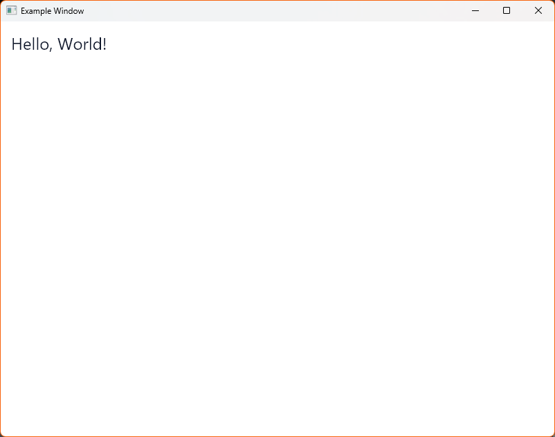
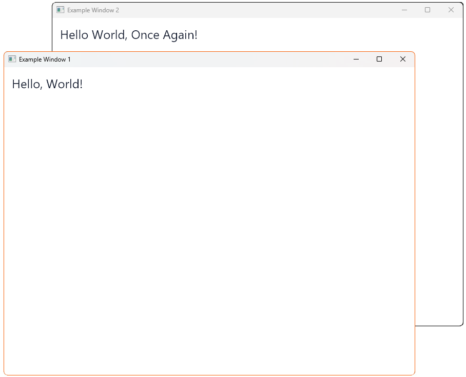

# Getting started with HandyUI

## Quickstart

!!! note "A quick heads-up"
    All code examples in this page use the C# 9 feature **Top-level Statements**.

## Creating a window

Getting started with HandyUI also includes creating a testing window.

To do that, you can paste in this code to your code editor and create a example window.

```csharp linenums="1"
using HandyUI.Core.Classes.Controls;
using HandyUI.SilkNet.Classes.Helper;
using SkiaSharp;

var (window, renderer) = SilkWindowHelper.CreateWindowAndGetRenderer("Example Window", new SKSize(800, 600));

new TextLabel()
    .WithText("Hello, World!")
    .WithTextSize(24)
    .WithLocation(15, 15)
    .WithAddToRenderer(renderer);

await window.RunAsync();
```

Here's the result of running the piece of code given above:




## Creating multiple windows

You can also create multiple windows at the same time.

```csharp linenums="1"
using HandyUI.Core.Classes.Controls;
using HandyUI.SilkNet.Classes.Helper;
using SkiaSharp;

var (window1, renderer1) = SilkWindowHelper.CreateWindowAndGetRenderer("Example Window 1", new SKSize(800, 600));
var (window2, renderer2) = SilkWindowHelper.CreateWindowAndGetRenderer("Example Window 2", new SKSize(800, 600));

new TextLabel()
    .WithText("Hello, World!")
    .WithTextSize(24)
    .WithLocation(15, 15)
    .WithAddToRenderer(renderer1);

new TextLabel()
    .WithText("Hello World, Once Again!")
    .WithTextSize(24)
    .WithLocation(15, 15)
    .WithAddToRenderer(renderer2);

await Task.WhenAll(window1.RunAsync(), window2.RunAsync());
```


Here's the result of running the piece of code given above:


